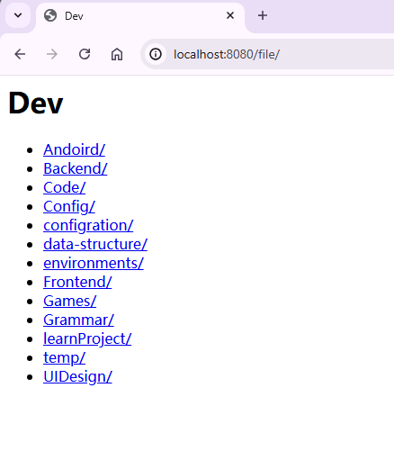

# simple-fileserver

一个简单的文件服务器基于SpringBoot实现。

- 一般的文件直接触发下载
- 图片文件会在浏览器展示
- 视频类型文件会直接播放(支持进度拖放)

### 如何启动

```sh
git clone https://github.com/lanlinju/simple-fileserver.git
cd simple-fileserver
python fileserver.py "/path/to/file/"

# 或者
./gradlew bootRun --args="/path/to/file/"

# 打包成jar包运行
./gradlew clean bootJar
java -jar build/libs/simple-fileserver-0.0.2.jar "/path/to/file/"
```
开启文件服务器之后，直接在PC浏览器中输入地址`localhost:8080/`

#### 使用手机浏览器如何浏览

1. 首先确保电脑和手机处于同一局域网下
2. 在电脑端打开终端`Terminal`，输入`ipconfig`，然后按回车键`Enter`,找到本机的ipv4地址，
   例如下图中的`192.168.1.47`。

   

3. 最后在手机浏览器中输入`192.168.1.47:8080/`, 注意以自己的ip地址为主。

### 命令行启动

1. 首先下载jar包[simle-fileserver](https://github.com/lanlinju/simple-fileserver/releases)
2. 在命令行终端中输入以下命令:

```shell
java -jar simple-fileserver.jar D:/
#或者
java -jar simple-fileserver.jar
```

```sh
--directory=D:/your/path  显式指定要浏览的目录,如果不指定默认jar包当前启动目录
--inline-display=false  视频类型文件是否浏览器播放，if是false，直接下载,默认true
```

### 应用截图

1. 电脑浏览器截图

   

2. 手机浏览器截图

   

### 项目如何打包成jar包

#### 1. 打包命令：

在项目根目录下运行以下命令来打包应用程序：

```shell
./gradlew clean bootJar
```

运行成功后，目标文件（build/libs/simple-fileserver-0.0.2.jar）将被生成。
或者下图中的方式：

